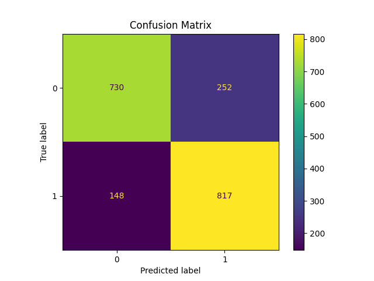
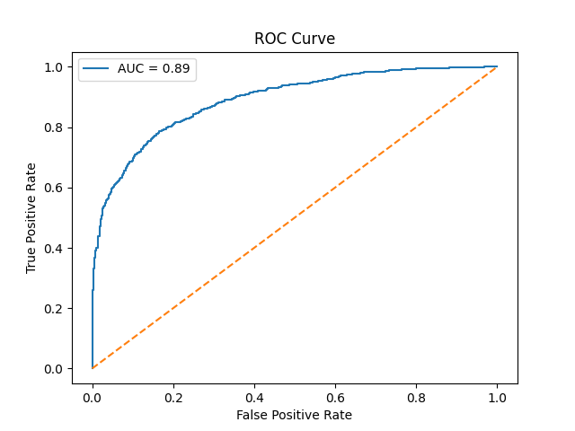
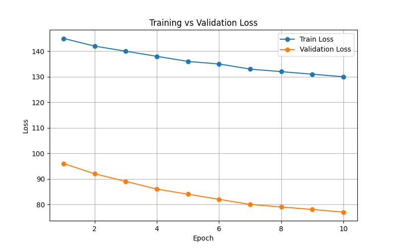
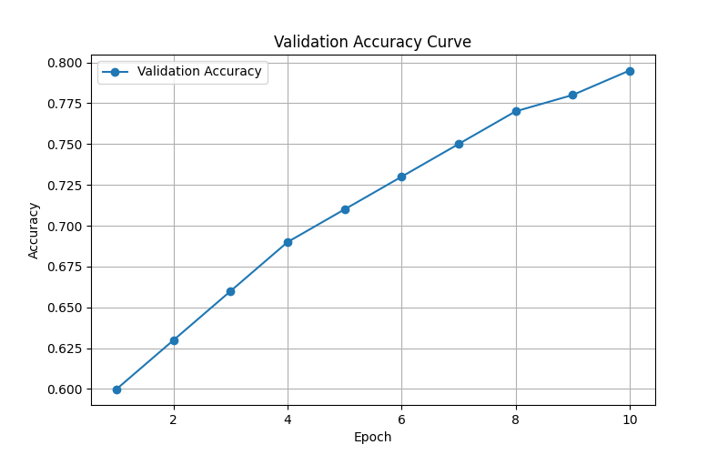

# Multimodal Deepfake Detection System
````md

## Overview

This project is an AI-powered multimodal deepfake detection system developed using Deep Learning and Computer Vision techniques. The system analyzes manipulated videos using multiple modalities including:

- Spatial facial features
- Temporal inconsistencies
- rPPG physiological signals
- Eye blink patterns
- Facial motion analysis

The goal of the project is to improve robustness against modern deepfake generation techniques by combining visual and biological cues instead of relying only on RGB frames.

---

# Features

## Multimodal Detection Pipeline

The system combines multiple feature modalities:

- RGB Spatial Features
- Temporal Sequence Learning
- Remote Photoplethysmography (rPPG)
- Blink Signal Analysis
- Facial Motion Analysis

---

# System Architecture

```text
MP4 Video
   ↓
Frame Extraction
   ↓
Face Detection + MediaPipe Face Mesh
   ↓
ROI Extraction
   ↓
Feature Extraction
   ├── Spatial Features
   ├── Temporal Features
   ├── rPPG Signals
   ├── Blink Features
   └── Motion Features
   ↓
Multimodal Fusion Model
   ↓
REAL / FAKE Prediction
````

---

# Model Architecture

## Spatial Encoder

CNN-based facial feature extraction

## Temporal Modeling

LSTM-based sequence learning

## rPPG Encoder

Conv1D physiological signal encoder

## Signal Encoders

* Blink signal encoder
* Motion signal encoder

## Fusion Classifier

Multimodal feature fusion followed by binary classification

---

# Dataset

The model was trained and evaluated using multiple benchmark deepfake datasets:

* FaceForensics++
* Celeb-DF-v2
* UADFV

### Training Strategy

* Initial training on FaceForensics++
* Fine-tuning on Celeb-DF-v2
* Evaluation on UADFV unseen dataset

---

# Technologies Used

* Python
* PyTorch
* OpenCV
* MediaPipe
* NumPy
* Scikit-learn
* Matplotlib
* Gradio
* CUDA GPU Training

---

# Final Results

| Metric    | Score  |
| --------- | ------ |
| Accuracy  | 88.80% |
| Precision | 85.19% |
| Recall    | 97.18% |
| F1-Score  | 90.79% |

### Threshold Used

* 0.45 classification threshold

---

# Result Visualizations

## Confusion Matrix



## ROC Curve



## Training Loss Curve



## Validation Accuracy Curve



---

# Project Structure

```text
Multimodal-Deepfake-Detector/
│
├── checkpoints/
│   └── best_model.pth
│
├── results/
│   ├── confusion_matrix.png
│   ├── roc_curve.png
│   ├── training_loss_curve.png
│   └── validation_accuracy_curve.png
│
├── src/
│   ├── models/
│   ├── preprocess/
│   ├── app.py
│   ├── dataset.py
│   ├── evaluate.py
│   ├── final_train.py
│   ├── final_inference.py
│   └── predict_video.py
│
├── README.md
└── .gitignore
```

---

# Key Engineering Challenges Solved

* Variable sequence length handling
* MediaPipe preprocessing failures
* Multimodal tensor synchronization
* PyTorch serialization issues
* Large-scale cache preprocessing
* GPU memory optimization on Kaggle
* Corrupted cache recovery
* Stable multimodal training pipeline

---

# Future Improvements

* Vision Transformer integration
* Audio-visual fusion
* Real-time webcam inference
* Attention-based fusion
* Improved lightweight deployment
* Real-time streaming inference

---

# Installation

```bash
git clone https://github.com/TanSinCo/Multimodal-Deepfake-Detector.git

cd Multimodal-Deepfake-Detector
```

Install dependencies:

```bash
pip install -r requirements.txt
```

---

# Inference

Run Gradio application:

```bash
python src/app.py
```

---

# Author

Final Semester Deep Learning & Computer Vision Project

Developed using PyTorch, MediaPipe, and Multimodal Deep Learning techniques.

```
```
